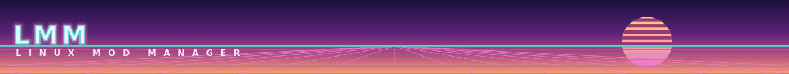
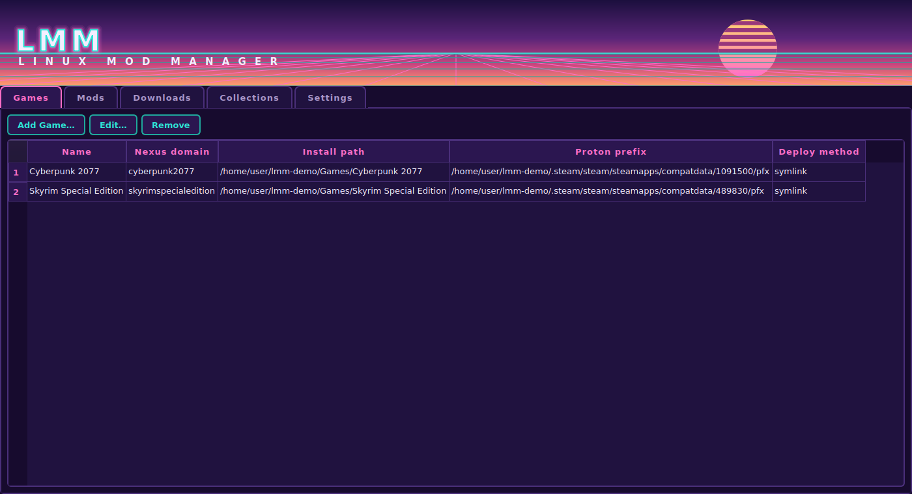
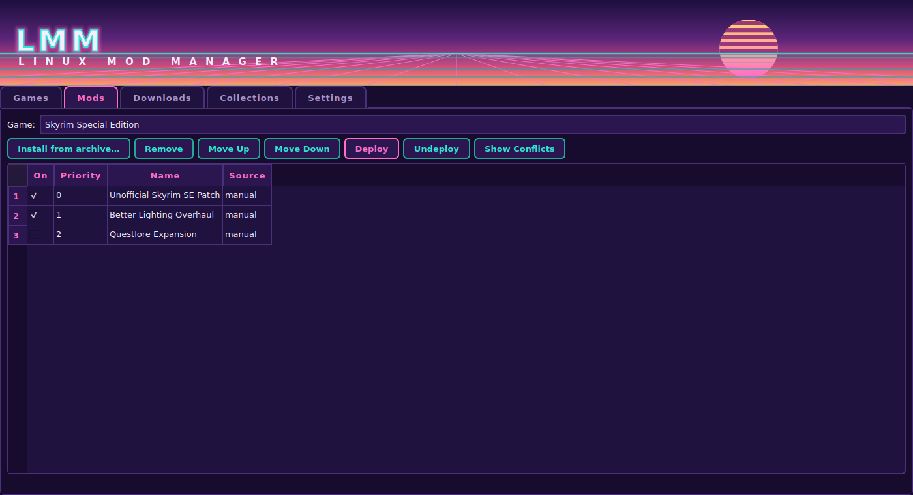
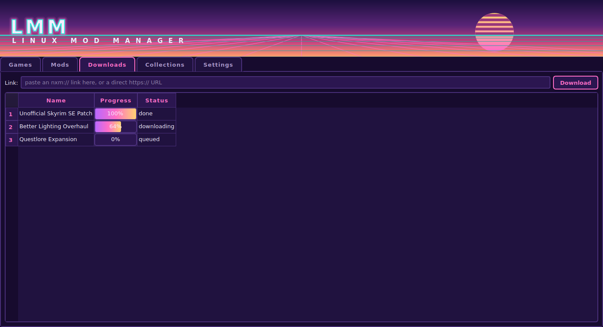
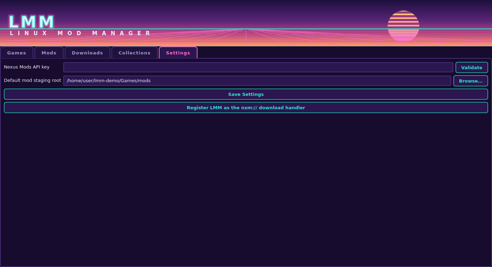

# LMM - Linux Mod Manager



A mod manager for Linux (built and tested with CachyOS in mind) that ties
together three things Linux modding usually leaves you to glue by hand:

- **Nexus Mods downloads** - a `nxm://` link handler, a REST API client, and
  Collection manifest import, so clicking "Mod Manager Download" on the
  website flows straight into LMM.
- **Proton prefix linking** - each game you manage points at the Steam
  library, install path, and Proton prefix it actually runs in, so LMM
  (and any tool you launch through it) knows exactly which prefix to use.
- **Mod deployment** - mods are extracted into a staging directory and
  deployed into the game's real folder as symlinks, in a load order you
  control, with conflicts surfaced instead of silently overwritten.

## How it works

Mods are never extracted directly into your game folder. Each installed
mod lives in its own subfolder under a per-game staging directory
(`mods_dir`). "Deploy" walks your enabled mods in priority order and
symlinks their files into the game's real directory (`install_path` +
`deploy_subpath`, e.g. `.../Skyrim Special Edition/Data`); a later mod's
file silently wins over an earlier one at the same path, and every such
collision is reported as a conflict. "Undeploy" removes exactly the links
LMM created - it verifies each link still points at the mod file it came
from before removing it, so it never touches a real game file or a link
you've since replaced by hand.

This mirrors the "simple" deployment mode of MO2/Vortex, minus the
Windows-only virtual filesystem trick - on Linux, symlinks into the real
game directory are the reliable option under Proton.

## Screenshots

| Games | Mods |
| --- | --- |
|  |  |

| Downloads | Settings |
| --- | --- |
|  |  |

## Installing

### CachyOS / Arch

```sh
cd packaging
makepkg -si
```

`python-vdf` is AUR-only - install it with an AUR helper first (`paru -S
python-vdf`), or build the whole package with an AUR helper pointed at
`packaging/` so it resolves it for you. Everything else (`pyside6`,
`python-py7zr`, `python-rarfile`) is in the official `extra` repo, so
plain `pacman`/`makepkg` handles them. `unrar` is an optional dependency
needed only if you install `.rar` mod archives.

### From source (any distro)

```sh
python -m venv .venv
source .venv/bin/activate
pip install -e .
lmm
```

## Getting started

### 1. Connect your Nexus Mods account

Settings tab - paste your [Nexus Mods API
key](https://next.nexusmods.com/settings/api-keys), click **Validate**, and
click **Register LMM as the nxm:// download handler** so download buttons on
the site open LMM instead of your browser trying (and failing) to handle
them.

### 2. Add a game

Games tab - **Add Game**, then **Detect from Steam…** to pick an installed
Steam app; this fills in the install path, AppID, and Proton prefix
automatically. Set the **Nexus Mods game domain** (e.g.
`skyrimspecialedition`, `fallout4`) and the **deploy subfolder** (`Data` for
Bethesda games, blank for games that mod directly into their root).

To launch the game itself, also set its **Game executable (.exe)**, then use
**Launch Game** on the Games tab. LMM launches Proton directly - never
through the Steam client - so Steam has no visibility into the launch
regardless of whether the game is also owned there (e.g. running a
separately-installed GOG copy).

**Privacy / network isolation**: check **Launch with no network access** to
run the game - and any tool run in its prefix - inside a network namespace
with no interfaces at all (via `bubblewrap`), a kernel-level guarantee
rather than a firewall rule that could be misconfigured or bypassed. Needs
the `bubblewrap` package; LMM refuses to launch rather than silently launch
without isolation if it isn't installed.

### 3. Install and manage mods

Mods tab - install a mod from a downloaded archive, or just click a "Mod
Manager Download" button on Nexus Mods once the handler is registered.
Reorder mods (later = higher priority = wins file conflicts), then
**Deploy**. **Show Conflicts** lists exactly which files collide between
mods before you deploy, so you're not guessing.

The mod table supports ctrl/shift-click multi-select: **Remove Selected**
deletes everything selected in one confirmation instead of one at a time,
and **Remove All…** clears a game's entire mod list in one step (handy for
starting over after a big collection install).

### 4. Nexus Collections

Collections tab - paste a collection's URL (e.g.
`https://www.nexusmods.com/fallout4/collections/5atq9t` - the `/games/`
segment some URLs include is also accepted) and click **Fetch from Nexus**
to pull its mod list directly from Nexus's own GraphQL API - the same data
the collection's page itself renders with, so it needs no Vortex, no login
flow, and works for any account tier.

Then **Queue downloads for selected game**, which *is* gated to **premium**
API keys - that's the same restriction Nexus's own tools apply to bulk
downloads, not something LMM adds; see the note in
`src/lmm/nexus/collections.py`. On a free key, open the collection's
**Mods** tab on the website instead and download each mod individually -
those are ordinary `nxm://` links LMM already handles.

If the GraphQL fetch ever breaks (it's an undocumented, best-effort query),
**Import collection.json…** still works as a fallback - get that file by
running Vortex/the Nexus Mods App once to fetch the collection and copying
`collection.json` out of its profile directory.

Mods queued this way are installed in the **collection's authored order**
(appended after whatever's already installed), regardless of which
download happens to finish first - downloads run several at a time, so
completion order alone would otherwise scramble the load order. This
gives you a sane starting point, not a guarantee of zero conflicts; use
**Show Conflicts** on the Mods tab afterwards to see what's left to
resolve by hand.

### 5. Bethesda plugin load order (Skyrim SE, Fallout 4, etc.)

Check **Manage Bethesda-style plugin load order** on the game (Add/Edit
Game) and set its **Plugins.txt path** - the full file path, e.g.
`<prefix>/drive_c/users/steamuser/AppData/Local/Fallout4/Plugins.txt`. Click
**Detect…** next to that field to find it automatically instead of typing
it by hand: it lists the Proton prefix's actual local-appdata folders
(filtering out the generic Windows/Wine system ones) and matches by name
against the game. If the game has never been launched in that prefix yet,
there's nothing there to find - launch it once first (**Launch Game** is
enough, even just reaching the main menu).

The Mods tab gains a **Plugin Load Order** section:

- **Sync from Mods** detects every `.esp`/`.esm`/`.esl` your enabled mods
  provide and merges them into the tracked list (existing order/enabled
  state is preserved; removed mods' plugins drop out automatically).
- **Move Up**/**Move Down** reorders them; the checkbox enables/disables
  without removing.
- Multi-select (ctrl/shift-click) works here too - **Remove Selected**
  drops entries from the tracked list. Note this doesn't stop a plugin
  reappearing on the next Sync if its mod is still enabled - it's for
  cleaning up stale entries, not permanently excluding one.
- **Write Plugins.txt** saves the current order in the correct
  `*name.esp` (active) format.

LMM deliberately does **not** attempt LOOT-style master-dependency
auto-sorting - that needs LOOT's own community masterlist rules, which
can't be replicated reliably here, and getting a large load order subtly
wrong is worse than not automating it. Use the real thing instead:

1. Install [LOOT](https://flathub.org/apps/io.github.loot.loot) (Flathub is
   the devs' own recommendation for Linux; an unofficial AUR package also
   exists). It's a native Linux app - it reads/writes plain files directly
   and doesn't need to run through Proton itself.
2. In LOOT's Settings for this game, set **two separate paths**: "Game
   path" (the install folder containing the `.exe` and `Data`) and "Game
   local path" (the *same folder* you set as LMM's Plugins.txt path, but
   without the filename - just the folder). Auto-detection on Linux only
   finds Steam/Heroic installs and will usually get the local path wrong
   regardless, since it lives inside your Proton prefix.
3. Run LOOT's sort, review the diff it shows you, apply.
4. Back in LMM, **Import from Plugins.txt** to pull LOOT's result back in.

## Project layout

```
src/lmm/
  config.py, models.py, paths.py   application config & data model
  assets/                          bundled app icon (source SVG)
  nexus/                           Nexus Mods API client, nxm:// links, collections
  proton/                          Steam library/app/Proton discovery, prefix linking
  mods/                            archive extraction, downloader, deploy engine, ModManager
  gui/                             PySide6 main window and tabs
tests/                             pytest suite for everything above the GUI layer
packaging/                         PKGBUILD, .desktop file, and generated hicolor icons for Arch/CachyOS
scripts/generate_icons.py          regenerates packaging/icons/ from src/lmm/assets/icon.svg
```

The GUI is a thin layer over `mods/manager.py`, `mods/deploy.py`,
`nexus/api.py`, and `proton/`. All of the actual logic is framework-free
and unit tested; the tabs mostly wire widgets to those calls.

## Running the tests

```sh
pip install -e ".[dev]"
pytest
```
